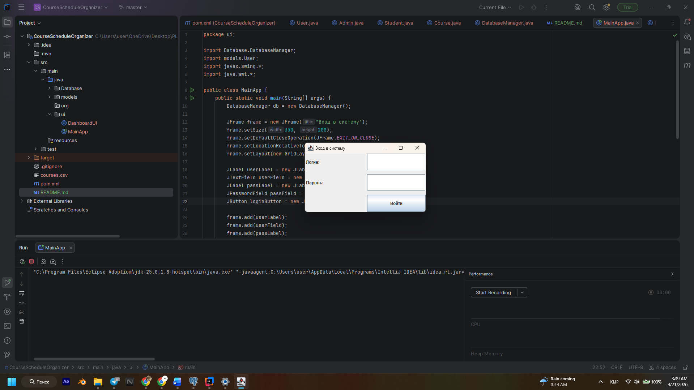
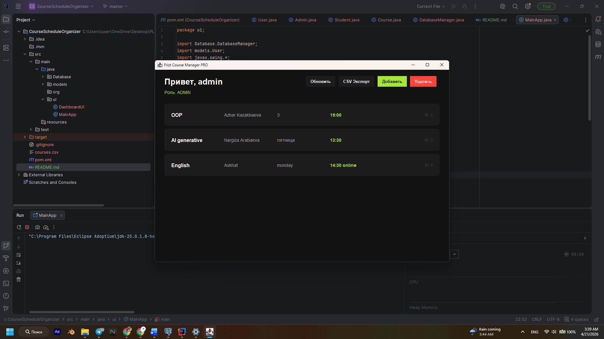
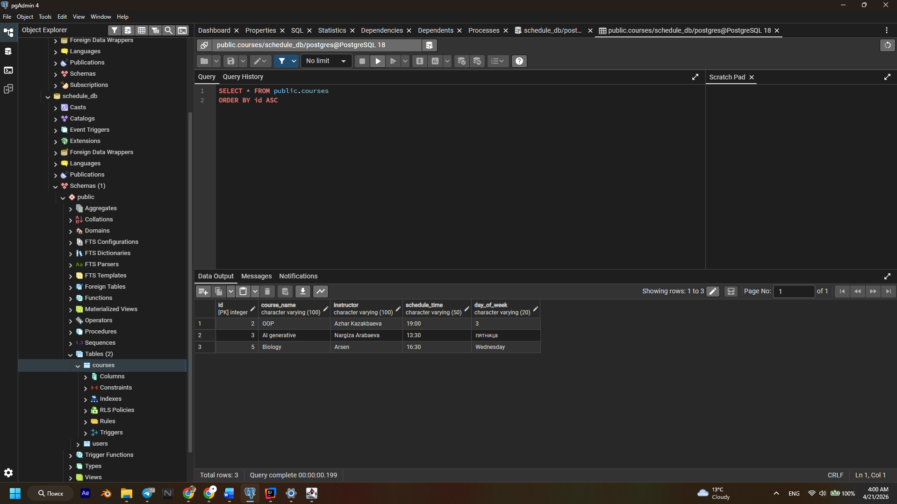

# 🎓 Course Schedule Organizer PRO

**Author:** Anas Kamchybekov
**Group:** COMFCI-23

## 📝 Description
Course Schedule Organizer is a modern desktop application for managing course schedules. The project is built on Object-Oriented Programming (OOP) principles using Java, the Swing GUI framework (with FlatLaf), and a PostgreSQL relational database. The application supports role-based access control (Administrator/Student) and ensures reliable data persistence.

## 🎯 Objectives
- Create an intuitive schedule management system with a modern design.
- Demonstrate a deep understanding of OOP principles (Encapsulation, Inheritance, Polymorphism).
- Ensure data persistence using an SQL database and CSV file processing.
- Implement a secure role-based access model.

## ✅ Project Requirement List (Completed Requirements)
1. **CRUD Operations:** Full implementation of creating, reading, updating, and deleting courses.
2. **GUI Implementation (Bonus):** Modern graphical user interface featuring a "Dark Mode" (FlatLaf) instead of a standard CLI.
3. **Database Integration (Bonus):** Utilization of PostgreSQL and JDBC instead of basic text files for data storage.
4. **Authentication & Roles (Bonus):** Login system with role segregation (ADMIN has full control, STUDENT has read-only access).
5. **Input Validation:** Validation checks for empty fields when adding new courses.
6. **Modular Design:** Clean code architecture separated into packages: `models`, `database`, and `ui`.
7. **Error Handling:** Robust management of `SQLException` and `IOException` using try-catch blocks.
8. **Encapsulation:** All fields within data models (`Course`, `User`) are private and accessed strictly via getters and setters.
9. **Inheritance:** Both `Admin` and `Student` classes inherit from the abstract `User` base class.
10. **Polymorphism:** Method overriding and dynamic UI adaptation based on the user's role (e.g., hiding modification buttons for students).
11. **Data Export:** Built-in functionality to export the current course schedule into a `CSV` format.

## 🛠 Documentation
- **Algorithms & Data Structures:** Usage of `List<Course>` (ArrayList) to retrieve, store, and process database records before rendering them in the UI.
- **Database Architecture:** The `schedule_db` database contains two related tables: `users` (for authentication) and `courses` (for the schedule). Database interaction is handled via the DAO (Data Access Object) pattern implemented in the `DatabaseManager` class.
- **UI Design:** A custom `RoundedPanel` class was engineered to create rounded course cards by overriding the native `paintComponent` method from the Java Swing library.

## 📁 Files
- `database.sql` — Database dump containing the table schemas and initial setup.
- `courses.csv` — The output file generated when the schedule export function is triggered.

## 📸 Test Cases and Outputs

Here is how the working application looks:

**1. Login Screen**
(Entering Admin credentials)

*(Note: The system date and time are visible on the screen as per the project requirements.)*

**2. Main Dashboard (Admin Panel)**
(All courses are displayed as stylized cards. Notice the `ID: 2, 3...` in the corners — this confirms the data is being retrieved from the PostgreSQL database!)

**3. pgAdmin Data View (Database Verification)**
(Screenshot from pgAdmin. The exact same courses—OOP, English, AI generative—are safely stored in the PostgreSQL table.)

**Link to Presentation:** [https://www.figma.com/deck/NyD7eEdppZsZhDAeLqF2Of](https://www.figma.com/deck/NyD7eEdppZsZhDAeLqF2Of)